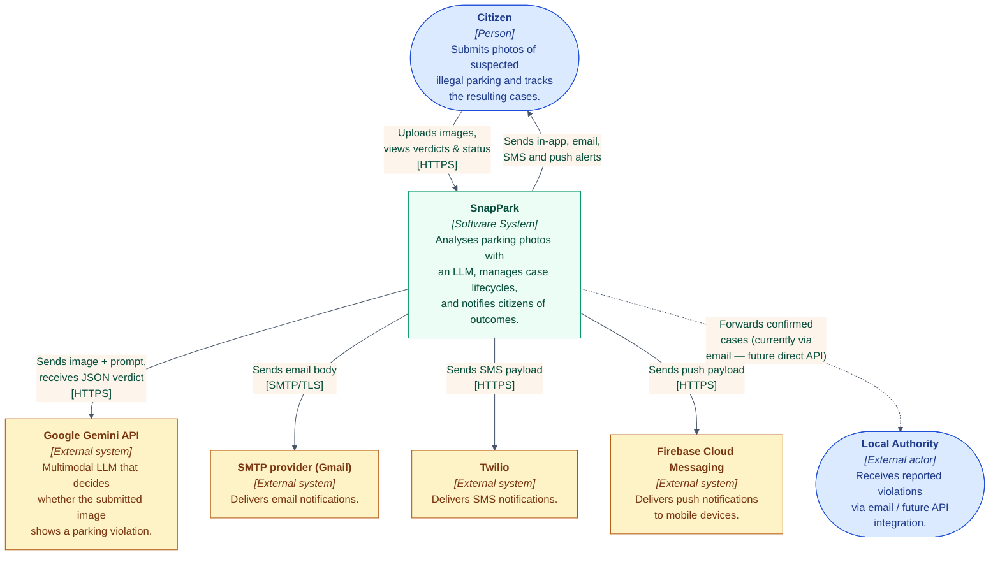

# System Context Diagram (C4 — Level 1)

**Audience:** the dissertation reader who has never seen the system before.
**Question it answers:** *what does SnapPark do, who uses it, and what does it talk to?*

It deliberately hides every internal detail (services, queues, databases) —
those belong on Level 2 (the [container diagram](02-container.md)).

## Reading the diagram

- **Solid arrows** are synchronous, request/response interactions today.
- **Dashed arrow** to *Local Authority* indicates the planned future
  integration; in the current implementation, "reporting to authority" is a
  state transition recorded in the database and an outbound email — not yet
  a direct API call.
- The four external systems (Gemini, SMTP, Twilio, FCM) all sit at the
  edge of the trust boundary. Credentials for each are kept in
  `deployment/.env` and never reach the frontend.

## Trust boundary

Everything inside the **SnapPark** box runs in our own infrastructure
(Docker Compose locally, Kubernetes in production). Everything outside is a
third-party dependency we cannot see or control.

This separation matters for the dissertation discussion of:

- **Scalability**: we scale the inner boxes; we cannot scale Gemini.
- **Reliability**: every outbound integration is wrapped in a circuit-breaker
  pattern (the multi-channel notifier uses `Promise.allSettled` so one bad
  channel never blocks the others).
- **Privacy**: only image bytes leave our boundary, and only to Gemini —
  never to a notification channel.
