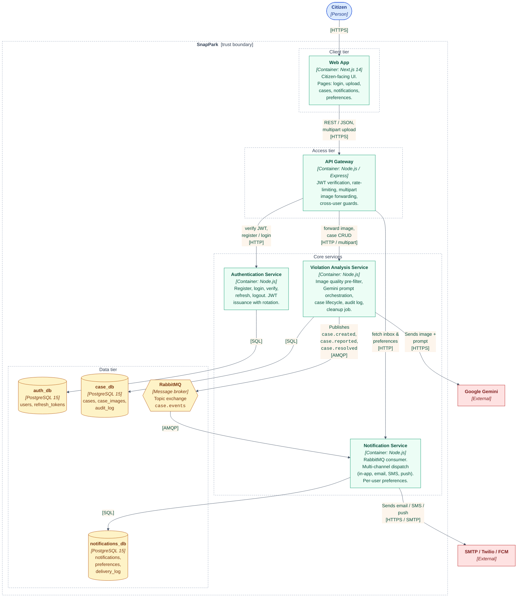

# Container Diagram (C4 — Level 2)

**Audience:** the dissertation reader who has read the
[system context](01-system-context.md) and now wants to know how the
**SnapPark** box is built internally.

A *container* in C4 means an independently deployable runtime — a process,
a database server, a message broker. It is **not** a Docker container in
the strict sense, although here every C4 container does map to one.

## Why this layout

| Decision                                                   | Reason                                                                                                                                |
| ---------------------------------------------------------- | ------------------------------------------------------------------------------------------------------------------------------------- |
| **One database per service**                               | Removes the temptation to join across business domains; lets each service evolve its schema without coupling.                         |
| **API Gateway in front of every service**                  | Centralises JWT verification, rate-limiting, and cross-user authorisation. Services downstream of the gateway can trust `X-User-Id`.  |
| **Gemini call is *inside* the violation-analysis service** | Keeps the LLM-specific concerns (prompt template, JSON parsing, retries) co-located with the case lifecycle that needs the answer.    |
| **Notification fan-out via RabbitMQ**                      | Decouples the synchronous user request (`/violations/analyze` returns once Gemini answers) from the asynchronous multi-channel delivery (which can take seconds for SMTP). |
| **Channels are pluggable**                                 | The notification service registers each channel only if its credentials are present, so a developer can run the stack locally with just in-app + email enabled. |

## What's not on this diagram

- The **pgAdmin** container — it's a development convenience, not part of the system architecture.
- The **cleanup job** inside the violation service — it's a `setInterval` inside the same process, not a separate container.
- The **Kubernetes** deployment — same logical containers, just with replica counts ≥ 1 and an Ingress in place of the local port mapping. Manifests live in [deployment/kubernetes/](../../deployment/kubernetes).
