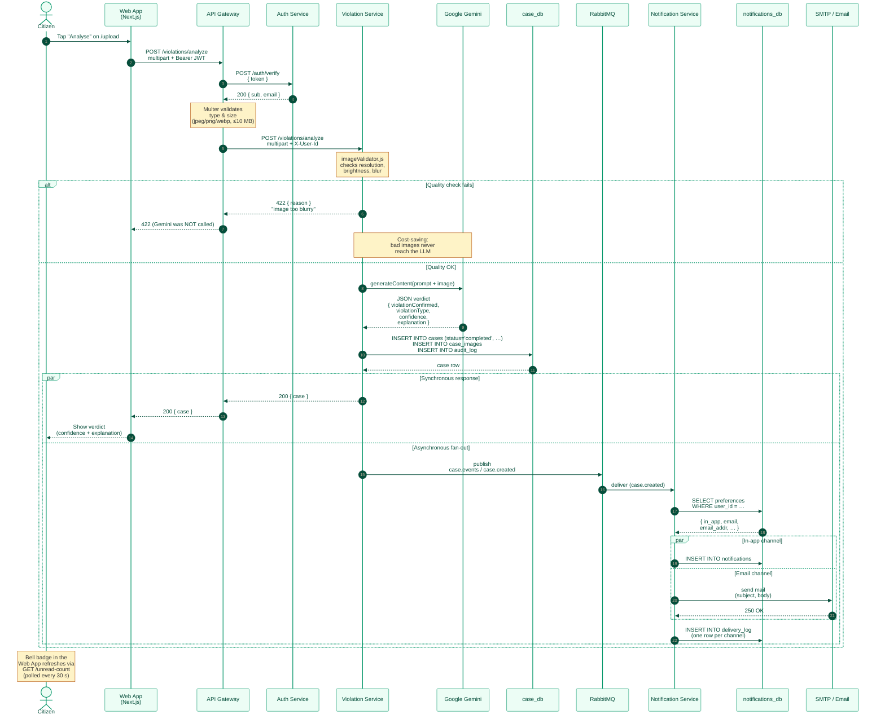

# Event-Flow Sequence Diagram

**Audience:** the dissertation reader who has seen the
[container diagram](02-container.md) and now wants to see *what actually happens
in time* when a citizen reports a violation.

This diagram traces a single happy-path request from the citizen's tap on
"Analyse" to the email landing in their inbox — including every cross-service
hop and the asynchronous handoff via RabbitMQ.

## Reading the diagram

- **Steps 1–3 — JWT verification.** The gateway *never* trusts a token blindly;
  it round-trips to the auth service for every protected request. This is the
  reason the auth service is on the hot path of every call.
- **Steps 5–6 — Quality pre-filter.** This is the cheapest and most important
  optimisation in the system. A blurry photo costs us a Postgres write but
  *zero* Gemini API calls. The dissertation evaluation chapter quantifies the
  saving.
- **Step 8 — the LLM call.** This is the only synchronous external dependency
  in the user's wait time. The implementation enforces a 30 s timeout at the
  gateway level so a stalled Gemini call never holds an HTTP socket open
  indefinitely.
- **Step 11 — `par` block.** As soon as the case is persisted, two things
  happen *in parallel*: the user receives their verdict, and the event is
  published to RabbitMQ. The user's response time is **not** gated on the
  notification fan-out.
- **Steps 12–17 — multi-channel fan-out.** The notification service uses
  `Promise.allSettled` over the user's enabled channels. A failing SMTP server
  produces a `delivery_log` row with `status='failed'` but does **not** block
  the in-app insert.

## Failure modes covered by this diagram

| What fails                | How the system responds                                                          | Where to verify                                   |
| ------------------------- | -------------------------------------------------------------------------------- | ------------------------------------------------- |
| JWT expired / revoked     | Auth service returns 401; gateway short-circuits with 401                         | step 3                                            |
| Image too blurry / dark   | Quality pre-filter returns 422 *before* Gemini is called                          | the `alt` branch                                  |
| Gemini returns malformed JSON | `parseResponse()` in `gemini.js` throws; the case row is *not* persisted     | step 9                                            |
| RabbitMQ unreachable      | The publish call throws; the user still receives their verdict (synchronous path completed) — the case is just left without a notification | step 11 (right side) |
| SMTP rejects the mail     | `delivery_log` records status=`failed`; in-app notification still arrives        | step 16                                           |

## What this diagram intentionally omits

- The **case lifecycle** transitions (`PATCH /report`, `PATCH /resolve`) — they
  follow the same pattern as the `case.created` event with `case.reported` and
  `case.resolved`.
- **Token rotation** during refresh — covered in the auth service's own README.
- The **cleanup job** that archives completed cases after 24 h — runs on a
  timer, not on the user request path.
